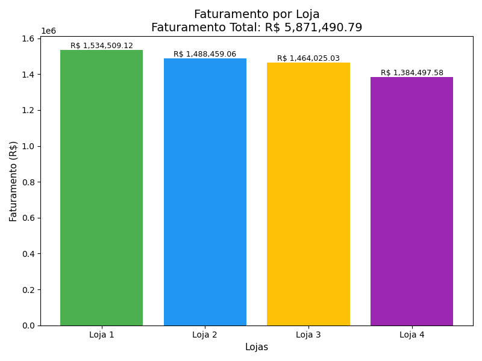
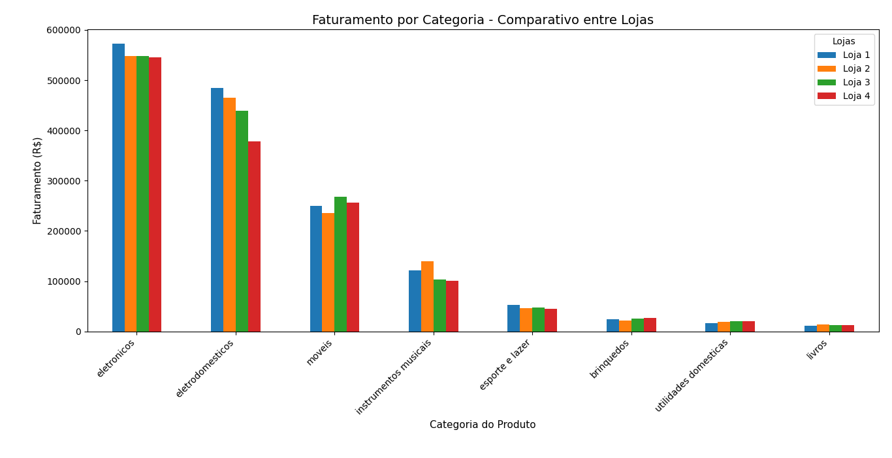
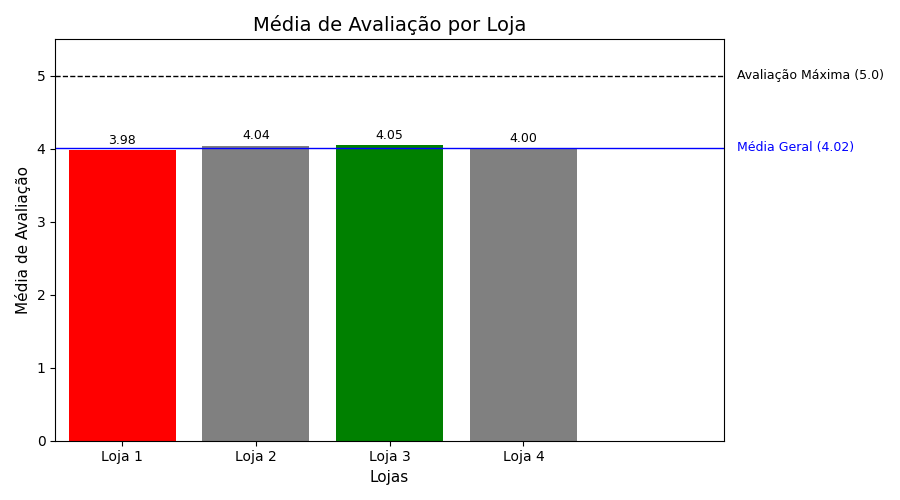
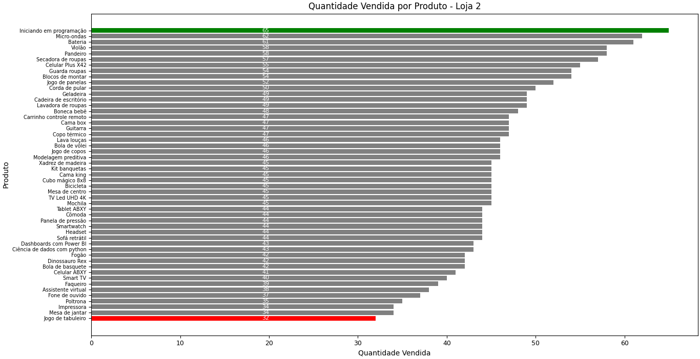
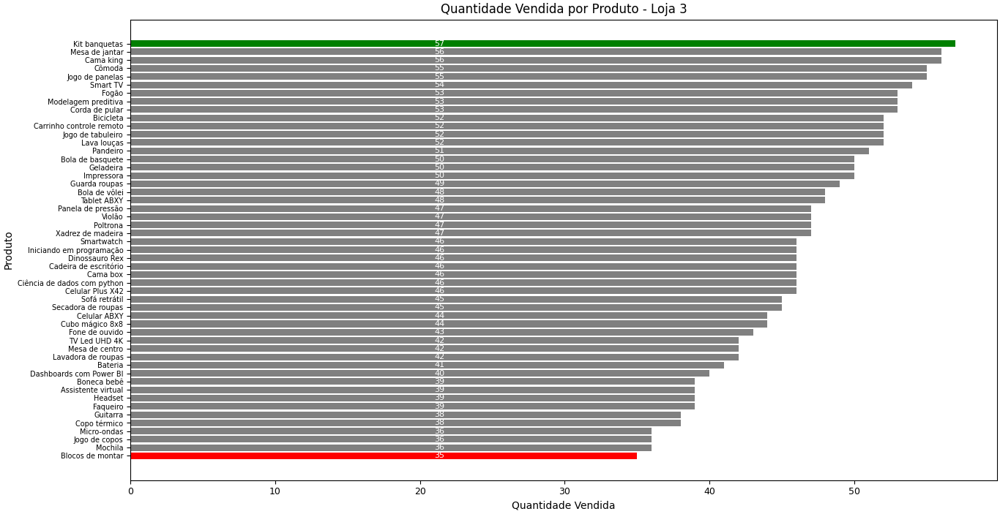
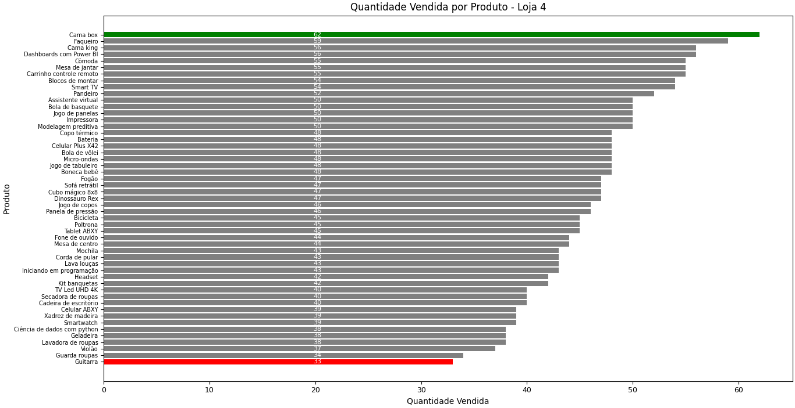
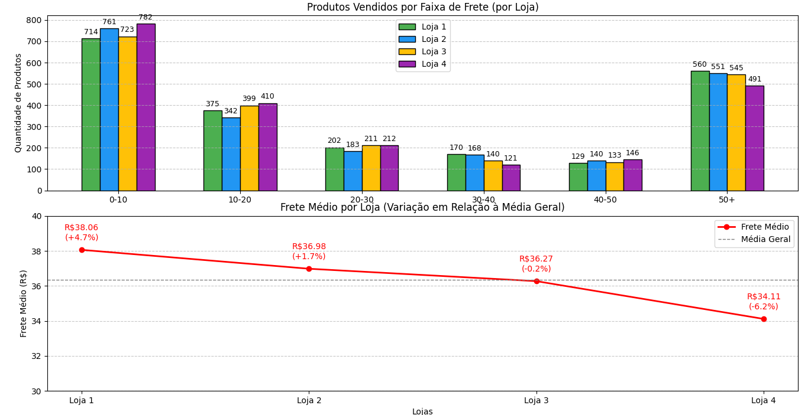
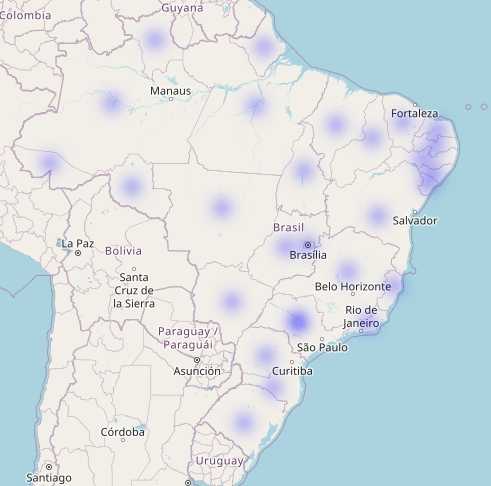

# 🧾 Relatório Final – Análise de Desempenho das Lojas

## 📌 Introdução

O objetivo deste relatório é auxiliar o Sr. João a tomar uma decisão estratégica sobre **qual das quatro lojas vender**. A partir de uma análise detalhada dos dados de vendas, avaliações e localização geográfica, buscamos identificar a loja com o **pior desempenho geral**, considerando os seguintes fatores:

- Faturamento total
- Categorias mais e menos vendidas
- Avaliação média dos clientes
- Produtos mais e menos vendidos
- Frete médio
- Distribuição geográfica das vendas

---

## 📊 Análise dos Indicadores

### 💰 Faturamento Total

A seguir, o gráfico mostra o faturamento total de cada loja:

- **Loja 1**: Maior faturamento geral, indicando forte desempenho.
- **Loja 2**: Faturamento intermediário e estável.
- **Loja 3**: Levemente abaixo da Loja 2, desempenho mediano.
- **Loja 4**: Menor faturamento total.

---

### 📦 Categorias de Produtos

- **Loja 1**: Maior diversidade de categorias vendidas.
- **Loja 2**: Foco em poucas categorias com vendas concentradas.
- **Loja 3**: Baixa diversidade e baixo volume.
- **Loja 4**: Desempenho misto – boas vendas em algumas categorias, fraco em outras.

---

### 🌟 Avaliação Média dos Clientes

- **Loja 1**: Pior avaliação, indicando insatisfação do cliente.
- **Loja 2**: Avaliação positiva, mas não a mais alta.
- **Loja 3**: Melhor avaliação média dos clientes.
- **Loja 4**: Avaliação mediana, com margem para melhorias.

---

### 🛒 Produtos Mais e Menos Vendidos

 

- **Loja 1**: Mais produtos com alta saída.
- **Loja 2**: Boa performance com poucos produtos líderes.
- **Loja 3**: Baixa rotatividade de produtos.
- **Loja 4**: Mistura de produtos populares e encalhados.

---

### 🚚 Frete Médio

- **Loja 1**: Frete mais caro, porém tem a maior quantidade de vendas com frete maior de R$50,00.
- **Loja 2**: Frete proximo da média.
- **Loja 3**: Frete proximo da média.
- **Loja 4**: Frete mais barato, quantidade alta em frete grátis.

---

### 🗺️ Distribuição Geográfica das Vendas

- **Loja 1**: Alta concentração de vendas em áreas densas, porém atende todas as regiões.
- **Loja 2**: Boas vendas regionais com alta satisfação.
- **Loja 3**: Alcance geográfico limitado.
- **Loja 4**: Alcance geográfico limitado.

---

## ✅ Conclusão e Recomendação

Com base nas análises apresentadas, **recomendamos que o Sr. João venda a Loja 4**.

### Justificativa:

**Loja 4 apresenta os piores resultados gerais:**
- Menor faturamento
- Distribuição geográfica limitada

**A Loja 3**, embora também apresente pontos fracos, **tem mais potencial de recuperação**, especialmente com ajustes logísticos e foco em categorias de maior saída.

---

### 🏆 Lojas Recomendadas para Permanecer no Negócio

- **Loja 1**: Melhor desempenho geral (faturamento, variedade, alcance).
- **Loja 2**: Alta satisfação dos clientes e frete competitivo.

---

### 📤 Próximos Passos

Com base na decisão, recomendamos:
- Vender a Loja 4 o quanto antes.
- Reavaliar estratégias de logística e marketing para a Loja 3.
- Investir na expansão e manutenção das Lojas 1 e 2.

---

*Este relatório foi gerado com base em dados reais das vendas e análises exploratórias utilizando Python e bibliotecas de visualização como Matplotlib, Seaborn e Folium.*
